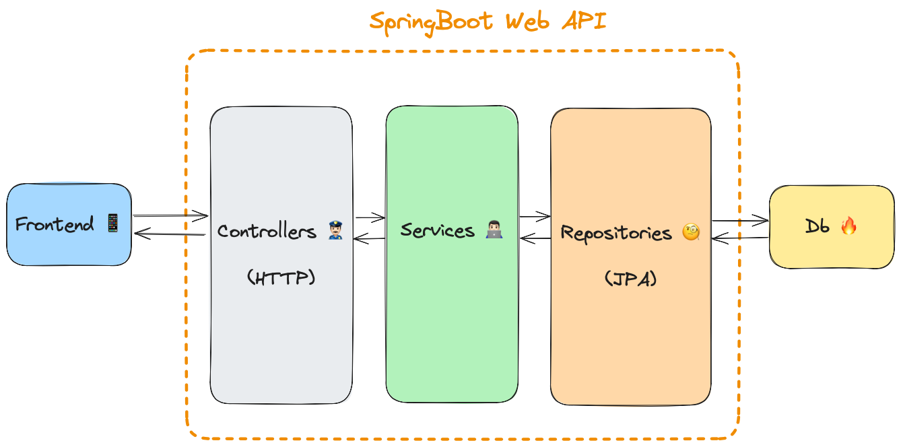

# Progetto IdS + Web e Mobile 23/24
Progetto realizzato dagli studenti [Alessio Rubicini](https://github.com/alessiorubicini), [Maria Vittoria Forlani](https://github.com/Vittoria61) e [Simone Morello](https://github.com/DiamondBest) per gli esami di
- Ingegneria del Software (prof. Polini e prof. Morichetta) [vedi [Progetto IDS.vpp](docs/Progetto%20IDS.vpp) e [backend](backend)]
- Applicazioni web, mobile e cloud (modulo web e mobile, prof. Bonura) [vedi [frontend](frontend)]

dei corsi di laurea in Informatica e Informatica per la Comunicazione Digitale dell'anno accademico 2023/24 presso l'Università degli Studi di Camerino.

## Descrizione del progetto
Il progetto propone la creazione di una piattaforma per la valorizzazione e digitalizzazione di territori comunali, permettendo il caricamento di informazioni culturali, turistiche, sportive e altri contenuti di interesse locale. I contenuti sono associati a punti fisici geolocalizzati o concetti amministrativi/geografici. Ogni comune gestisce i punti nel proprio territorio. L'obiettivo è creare una piattaforma collaborativa, consentendo ai cittadini di contribuire con contenuti dopo la verifica di conformità. La piattaforma supporta la creazione di itinerari o esperienze attraverso punti di interesse, caricati da responsabili o in modo collaborativo e validati successivamente.

## Frontend 📱

Lato frontend l'applicazione è stata realizzata utilizzando il framework **Angular**, implementa un pattern Single Page Application ed è stata sviluppata per essere responsive, e quindi fruibile sia in modalità web che mobile. Fa affidamento, tra le varie, sulle seguenti librerie npm:
- [auth0/angular-jwt](https://www.npmjs.com/package/@auth0/angular-jwt): modulo Angular che semplifica l'integrazione di JSON Web Token (JWT) 
- [ng-bootstrap](https://www.npmjs.com/package/@ng-bootstrap/ng-bootstrap): libreria di componenti Angular basata su Bootstrap
- [leaflet](https://www.npmjs.com/package/leaflet): libreria JavaScript leggera e flessibile per la creazione di mappe interattive, utilizzata in questo contesto per l'aggiunta di mappe tramite le API OSM (Open Street Map).

## Backend 🏗️

Il backend dell'applicativo è stato realizzato sfruttando il framework open-source **SpringBoot**, in particolar il modo il suo modulo web per lo sviluppo di API REST. Per quanto riguarda la persistenza dei dati, il servizio web fornito fa affidamento sulle **JPA (Java Persistence API)** per comunicare con il **database MySQL** sottostante.

Il backend fa affidamento, tra le varie, sulle seguenti librerie:
- [spring-boot-starter-web](https://mvnrepository.com/artifact/org.springframework.boot/spring-boot-starter-web): dipendenze per lo sviluppo di applicazioni web con Spring Boot
- [spring-boot-starter-security](https://mvnrepository.com/artifact/org.springframework.boot/spring-boot-starter-security): dipendenze per l'integrazione di Spring Security in un'applicazione Spring Boot.
- [spring-boot-starter-data-jpa](https://mvnrepository.com/artifact/org.springframework.boot/spring-boot-starter-data-jpa): abilita l'integrazione di Spring Data JPA, che semplifica l'accesso e la gestione dei dati in un'applicazione attraverso Java Persistence API (JPA).
- [jjwt](https://mvnrepository.com/artifact/io.jsonwebtoken/jjwt-api): libreria per la gestione di JSON Web Token (JWT).
- [mysql-connector-java](https://mvnrepository.com/artifact/mysql/mysql-connector-java): driver JDBC per l'interazione con database MySQL

### Sicurezza 🔐
Nello sviluppo del sistema nella sua interezza è stata posta particolare attenzione sui seguenti aspetti di sicurezza:
- **Autenticazione e autorizzazioni**: vengono gestite grazie al framework Spring Security e fanno affidamento sullo standard **JWT (JSON Web Token)**, che ci consente di generare token crittograficamente sicuri inclusi in ogni richiesta del client. Questi token contengono informazioni verificabili e autorizzative, firmate con una chiave segreta conosciuta solo al server e codificate in Base64 (dati i fini didattici del progetto, la chiave segreta è stata lasciata visibile nella repository GitHub, vedi file [application.properties](backend/opencity/src/main/resources/application.properties)).
- **Richieste cross-origin**: per evitare problemi di CORS (Cross-Origin Resource Sharing) durante lo sviluppo, il client Angular è stato configurato in modo da inoltrare le richieste che vengono effettuate al backend tramite **proxy** (vedi [proxy.conf.json](frontend/src/proxy.conf.json)); questa configurazione ha lo scopo di facilitare lo sviluppo dati i fini didattici del progetto, mentre in un ambiente di produzione è necessario configurare correttamente il server per gestire le autorizzazioni CORS.
- **SQL Injections**: l'utilizzo delle JPA (Java Persistence API) lato backend permette una mappatura **ORM** (Object-Relational Mapping) uno a uno tra le classi Java e le tabelle relazionali della base di dati, e una generazione automatica delle query da parte del framework, rimuovendo la necessità di scrivere ed eseguire manualmente query SQL con conseguenti vulnerabilità di SQL Injection.
- **XSS (Cross-Site Scripting)**: l'inserimento dinamico di dati nei componenti Angular viene sempre effettuato utilizzando gli operatori di interpolazione appositi (`{{ value }}`), in modo che Angular stesso gestisca automaticamente l'escaping dei dati. Nonostante questo progetto non sia il caso, nell'eventualità di manipolazione dinamica dell'HTML tramite il DOM, si renderebbe necessario l'utilizzo di un **DOM Sanitizer**, un servizio fornito da Angular che offre metodi per sanificare e gestire in modo sicuro i contenuti HTML, CSS e URL.
- **Trasferimento dati**: la mappatura ORM tra le classi Java lato backend e le tabelle della base di dati relazionale sottostante espone l'applicazione a potenziali rischi di sicurezza. Ad esempio se si desidera restituire all'utente le sue informazioni in fase di autenticazione, è bene non includere tra queste la sua password, che verrebbe inutilmente esposta nel trasferimento e nella memoria locale del browser dell'utente stesso. Per far fronte a questo tipo di problemi, è stato impiegato (in questo contesto in maniera leggera e solo dove necessario) il **DTO (Data Transfer Object)**, un design pattern utilizzato per trasferire dati tra i componenti di un'applicazione. Il DTO così non aiuta solo a migliorare la sicurezza, ma fornisce anche un modo strutturato per trasferire dati tra diversi componenti dell'applicazione, aiuta a ridurre le dipendenze tra i vari livelli, e ci permette di personalizzare la struttura dei dati da trasferire in base alle esigenze di specifici casi d'uso.